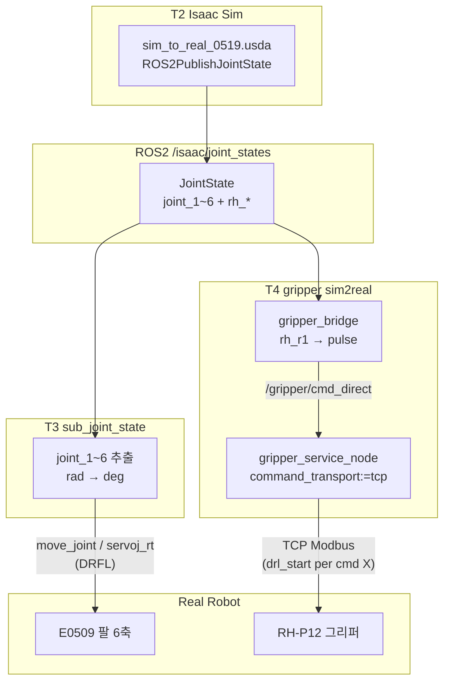

# 아키텍처 · 파일 구조 · 작동 방식 · Workflow

E0509 + RH-P12 **팔+그리퍼 동시 sim2real** 전체 설명.

---

## 1. Repo 파일 구조

```
isaacsimgrippersim2realv1/          ← git clone 루트 (= ~/sim2real_deploy)
├── README.md                       ← ★ 시작점: T1~T5 명령
├── .gitignore
│
├── isaac_assets/                   ← Isaac Sim 씬 (T2)
│   ├── my_robot/
│   │   └── sim_to_real_0519.usda   ← 메인 씬, /isaac/joint_states 발행
│   └── 0518_project/cube_pick_and_place/
│       └── e0509_with_gripper_v2/  ← USD 메시 (씬이 참조, 경로 유지 필수)
│
├── ros2_ws/src/                    ← colcon build 대상 (T1·T3·T4)
│   ├── isaac_sim_2_real/           ← T3 팔 브리지
│   │   └── sub_joint_state.py
│   ├── isaac_gripper_sim2real/     ← T4 그리퍼 브리지
│   │   ├── isaac_gripper_bridge_node.py
│   │   ├── gripper_conversion.py   ← rad → pulse 변환
│   │   ├── launch/sim2real_gripper.launch.py
│   │   └── config/sim2real_gripper.yaml
│   ├── rh_p12_rna_controller/      ← T4 gripper_service_node (Modbus/TCP)
│   │   ├── gripper_service_node.py
│   │   └── gripper_node.py
│   └── rh_p12_rna_controller_interfaces/
│       ├── srv/SetPosition.srv
│       └── msg/GripperState.msg
│
└── docs/
    ├── ARCHITECTURE_AND_WORKFLOW.md  ← 이 문서
    ├── GRIPPER_SIM2REAL.md           ← T4 상세
    ├── sim2real_command.md           ← T3 상세 (팔)
    └── reference/                    ← URDF, dsr_msgs2 참고
```

### repo 밖 (별도 설치)

| 항목 | 용도 |
|------|------|
| `/opt/ros/humble` | ROS2 |
| `~/doosan-robot2` | `dsr_bringup2`, DRFL (T1) |
| Isaac Sim | T2 씬 실행 |

---

## 2. 패키지별 역할

| 패키지 | 노드/실행 | 담당 | 터미널 |
|--------|-----------|------|--------|
| `doosan-robot2` | `dsr_bringup2` launch | E0509 컨트roller·RViz | T1 |
| Isaac Sim | `sim_to_real_0519.usda` | 시뮬 + ROS publish | T2 |
| `isaac_sim_2_real` | `sub_joint_state` | Isaac **팔 6축** → real | T3 |
| `isaac_gripper_sim2real` | `gripper_bridge` | Isaac **rh_r1** → pulse | T4 |
| `rh_p12_rna_controller` | `gripper_service_node` | pulse → Modbus (TCP) | T4 (launch 포함) |

---

## 3. ROS 메시지 · 토픽

### Isaac → ROS (공통 입력)

| 항목 | 값 |
|------|-----|
| 토픽 | `/isaac/joint_states` |
| 타입 | `sensor_msgs/JointState` |
| 단위 | rad |

```yaml
name: [joint_1, joint_2, joint_3, joint_4, joint_5, joint_6,
       rh_r1, rh_l1, rh_r2, rh_l2]
position: [팔 6개 rad, 그리퍼 4개 rad]   # rh_* 는 mimic, rh_r1이 마스터
```

### T3 팔 출력

| motion_mode | ROS 출력 | 타입 |
|-------------|----------|------|
| `move_joint` | `/dsr01/motion/move_joint` | `dsr_msgs2/srv/MoveJoint` |
| `servoj_rt` | `/dsr01/servoj_rt_stream` | `dsr_msgs2/msg/ServojRtStream` |

- `ServojRtStream.pos`: **6× float64 deg** (팔만)
- DRFL 경로 — **`drl_start` 사용 안 함**

### T4 그리퍼 출력

| 단계 | 토픽/서비스 | 타입 | 내용 |
|------|-------------|------|------|
| bridge → owner | `/gripper/cmd_direct` | `std_msgs/String` | `"custom 420 300"` (pulse, current) |
| owner → hardware | TCP :9105 | JSON Modbus frames | FC06/FC16 |
| telemetry | `/gripper/state` | `sensor_msgs/JointState` | 실측 pulse |

### 그리퍼 변환 (rh_r1 rad → pulse)

```
t = clamp(rh_r1_rad / 1.101, 0, 1)
pulse = round(100 + t * (420 - 100))   # 0 rad→100, 1.101 rad→420
```

---

## 4. 작동 방식 (동시 sim2real)



### 동시 가능한 이유

| 경로 | drl_start |
|------|-----------|
| T3 move_joint / servoj_rt | **없음** |
| T4 tcp + rh_p12_direct | **명령마다 없음** (초기 TCP 서버 1회) |
| T4 `command_transport:=drl` | **명령마다** → T3와 **동시 불가** |

---

## 5. Workflow (T1 ~ T5)

### Phase 0 — 설치 (1회)

```bash
git clone https://github.com/jasper104615-collab/isaacsimgrippersim2realv1.git ~/sim2real_deploy
source /opt/ros/humble/setup.bash
source ~/doosan-robot2/install/setup.bash
cd ~/sim2real_deploy/ros2_ws
colcon build --packages-select isaac_sim_2_real isaac_gripper_sim2real \
  rh_p12_rna_controller_interfaces rh_p12_rna_controller
source install/setup.bash
```

### Phase 1 — 기동 순서

| 순서 | 터미널 | 명령 | 필수 |
|------|--------|------|------|
| 1 | **T1** | `dsr_bringup2` launch | ✅ |
| 2 | **T2** | Isaac 씬 Play | ✅ |
| 3 | **T3** | `sub_joint_state` | ✅ (팔) |
| 4 | **T4** | `sim2real_gripper.launch.py` | ✅ (그리퍼) |
| 5 | **T5** | topic hz 확인 | 권장 |

> **T3 + T4 둘 다** 켜야 전체 sim2real. 하나만 켜면 해당 축만 움직임.

### Phase 2 — 공통 source (T1·T3·T4·T5)

```bash
source /opt/ros/humble/setup.bash
source ~/doosan-robot2/install/setup.bash
source ~/sim2real_deploy/ros2_ws/install/setup.bash
```

### Phase 3 — T1 Doosan bringup

```bash
ros2 launch dsr_bringup2 dsr_bringup2_rviz.launch.py \
  mode:=real host:=<ROBOT_IP> port:=12345 model:=e0509
```

### Phase 4 — T2 Isaac Sim

1. `~/sim2real_deploy/isaac_assets/my_robot/sim_to_real_0519.usda`
2. **Play**
3. `ros2 topic hz /isaac/joint_states`

### Phase 5 — T3 팔 sim2real

```bash
ros2 run isaac_sim_2_real sub_joint_state --ros-args \
  -p motion_mode:=move_joint \
  -p enable_motion:=true \
  -p input_topic:=/isaac/joint_states \
  -p max_publish_hz:=10.0 \
  -p move_joint_sync_type:=1
```

### Phase 6 — T4 그리퍼 sim2real (T3와 **동시**)

```bash
ros2 launch isaac_gripper_sim2real sim2real_gripper.launch.py \
  robot_ip:=<ROBOT_IP> enable_command:=true
```

### Phase 7 — T5 검증

```bash
ros2 topic hz /isaac/joint_states
ros2 topic echo /gripper/cmd_direct --once
ros2 topic echo /gripper/state --field position --once
# servoj_rt 모드일 때:
ros2 topic hz /dsr01/servoj_rt_stream
```

**성공 기준:** Isaac Hz + 그리퍼 cmd_direct + (팔 move_joint 로그 또는 servoj_rt Hz)

---

## 6. 금지 사항

| 금지 | 결과 |
|------|------|
| T3 없이 T4만 | 그리퍼만 움직임 |
| T4 없이 T3만 | 팔만 움직임 |
| `command_transport:=drl` | T3와 DRL 충돌 |
| `enable_motion:=false` / `enable_command:=false` | 해당 축 정지 |

---

## 7. 관련 문서

| 문서 | 내용 |
|------|------|
| [README.md](../README.md) | 빠른 시작 T1~T5 |
| [GRIPPER_SIM2REAL.md](GRIPPER_SIM2REAL.md) | T4·DRL |
| [sim2real_command.md](sim2real_command.md) | T3·튜닝 |
| [isaac_gripper_sim2real/README.md](../ros2_ws/src/isaac_gripper_sim2real/README.md) | T4 API |
